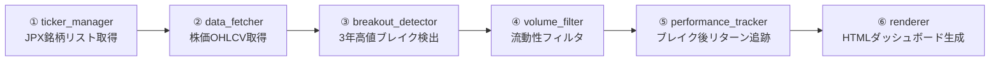

# 3年高値ブレイクアウトスクリーナー

[](https://github.com/waka-aki/3-year-high-breakout/actions/workflows/daily-scan.yml)

[](https://waka-aki.github.io/3-year-high-breakout/)

東証プライム・スタンダード・グロース市場の日本株（約3,700銘柄）を対象とした3年高値ブレイクアウトスクリーナー。
過去3年の高値を、60日間の静寂期間を経て初めて超えた銘柄を検出し、出来高・流動性ベースのフィルタリングで質の高い銘柄のみを抽出し、ブレイクアウト後のパフォーマンスを追跡し、HTMLダッシュボードを出力する。
GitHub Actions で毎営業日全自動実行され、結果は GitHub Pages で公開している。

> 🔗 **ライブダッシュボード**: <https://waka-aki.github.io/3-year-high-breakout/> （毎営業日 18:17 JST に自動更新）

## 技術スタック

| 領域 | 使用技術 |
|------|----------|
| 言語 | Python 3.12 |
| データ取得 | [yfinance](https://github.com/ranaroussi/yfinance)（株価 OHLCV・時価総額）、[JPX](https://www.jpx.co.jp/) 上場銘柄一覧（XLS） |
| データ処理 | pandas、xlrd / openpyxl |
| レンダリング | Jinja2 テンプレート + Tailwind CSS（CDN）、クライアントサイド JS によるテーブルソート |
| 自動実行 | GitHub Actions（cron スケジュール） |
| ホスティング | GitHub Pages |

## アーキテクチャ

`main.py` をオーケストレーターとして、6つのモジュールが順にデータを受け渡すパイプライン構成。各モジュールは単一責務で、出力は `data/` に CSV キャッシュされ増分更新される。



| # | モジュール | 役割 |
|---|-----------|------|
| ① | `ticker_manager` | JPX の XLS から銘柄コード・銘柄名・市場区分・33業種セクターを取得し、yfinance 形式（コード+`.T`）に変換してキャッシュ |
| ② | `data_fetcher` | yfinance 経由で 37ヶ月（約3年）ローリングウィンドウの OHLCV を増分取得（50銘柄/バッチ、2秒間隔） |
| ③ | `breakout_detector` | 終値が基準高値（直近60営業日を除く過去756営業日＝約3年の高値）を超え、かつ直近60営業日の全終値が基準高値以下だった銘柄を検出 |
| ④ | `volume_filter` | 売買代金（≧1億円）・時価総額（≧100億円）・出来高トレンドでフィルタリング |
| ⑤ | `performance_tracker` | ブレイク後 5 / 10 / 21 / 42 / 63 / 84 / 126 営業日のリターンを追跡（240日以内） |
| ⑥ | `renderer` | Jinja2 テンプレートから HTML ダッシュボードを生成 |

## セットアップ

```bash
python -m venv 52_breakout
source 52_breakout/bin/activate
pip install -r requirements.txt
```

## 実行方法

```bash
source 52_breakout/bin/activate
python src/main.py --update-tickers   # 初回: 銘柄リストDL + 株価取得（3年分）
python src/main.py                     # 2回目以降: キャッシュされた銘柄を使用
```

> **注意**: 初回実行時は約3年分の価格データを全銘柄分取得するため、数時間かかります。

## 銘柄の抽出条件

ダッシュボードに掲載される銘柄は、以下の条件をすべて満たしたものです。

- **対象市場**: 東証プライム・スタンダード・グロース市場の全内国株式（ETF・REIT等は除外）
- **ブレイクアウト判定**: 本日の終値が基準高値（静寂期間より前の過去3年間の高値）を上回った銘柄
- **60日静寂期間**: 基準高値は直近60営業日を除いた過去756営業日の高値（high列）から算出されます。直近60営業日間のすべての終値がこの基準高値以下であることが条件です。高値（ザラ場高値）で基準を設定し、終値で静寂を判定することで、ザラ場で一時的に高値をつけても終値が落ち着いていれば「静寂」とみなされます
- **最低履歴要件**: 価格データが60営業日未満の銘柄（新規上場直後など）は対象外です
- **当日売買代金 ≧ 1億円**: 流動性の低い銘柄を除外します
- **時価総額 ≧ 100億円**: 小型株を除外します
- **出来高トレンド**: 直近20日の平均出来高がその前20日間の平均出来高を上回っている銘柄のみを抽出します

## ダッシュボードの見方

### 1. サマリー

ページ上部に表示される概要情報です。

- 本日のブレイクアウト銘柄数
- 市場別の内訳（プライム / スタンダード / グロース）

### 2. 本日のブレイクアウト銘柄テーブル

本日新たに3年高値を更新した銘柄の一覧です。各カラムの意味は以下のとおりです。

| カラム | 説明 |
|--------|------|
| コード | 銘柄コード |
| 銘柄名 | 銘柄名 |
| セクター | JPXの33業種区分（例: 水産・農林業 / 化学 / 電気機器 / 銀行業 など）。N/Aは銘柄リストに業種データが無い場合 |
| 市場 | 市場区分（プライム / スタンダード / グロース） |
| 終値 | 本日の終値（円） |
| 3年高値 | 過去756営業日（約3年）の高値（円） |
| 出来高トレンド | 直近20日平均出来高 ÷ 前20日平均出来高。1.0より大きいほど出来高が増加傾向 |
| 売買代金（億） | 当日の売買代金（億円単位） |
| 時価総額（億） | 時価総額（億円単位）。yfinanceから取得しているため、株探・Yahoo Finance Japan等の日本側ソースの値と一部の銘柄で乖離があります（特に発行済株式数の取り扱いが異なる銘柄で顕著）。本スクリーナーでは流動性フィルタ（≥100億円）の判定と参考表示にのみ使用しています |

> **※ 廃止された指標**: 以前は PER / PBR / 売上成長率 / 営業利益率 を表示していましたが、yfinanceが日本株について返す値が日本側ソースと一致しないケースが多かったため、誤った数値で投資判断を誘導しないよう非表示化しました。

### 3. ブレイクアウト後パフォーマンステーブル

過去240日間にブレイクアウトした銘柄の、その後の値動きを追跡した一覧です。

- **セクター**: JPXの33業種区分。検出時点で銘柄リストに業種データが含まれていなかった行はN/Aと表示されます
- **市場**: 市場区分（プライム / スタンダード / グロース）
- **B価格**: ブレイクアウト時の終値（円）
- **5営業日 / 2週間 / 1か月 / 2か月 / 3か月 / 4か月 / 6か月**: ブレイクアウト日の終値を基準に、それぞれ 5 / 10 / 21 / 42 / 63 / 84 / 126 営業日後の終値で計算した騰落率（%）。表示はカレンダー上の目安期間ですが、内部計算は営業日固定です。緑色はプラス、赤色はマイナスを示します
- まだその営業日数が経過していない期間は「-」と表示されます

## ダッシュボードの閲覧方法

GitHub Actions により毎営業日 JST 18:17 頃にスキャンが自動実行され、結果がリポジトリにコミット・GitHub Pages へ反映されます。

最新のダッシュボードは以下からブラウザで直接閲覧できます（インストール不要）。

🔗 **<https://waka-aki.github.io/3-year-high-breakout/>**

ローカルで閲覧したい場合は、リポジトリを取得してブラウザで開いてください。

```bash
# 初回
git clone <リポジトリURL>
# ブラウザで開く
open output/dashboard.html        # macOS
xdg-open output/dashboard.html   # Linux
start output/dashboard.html      # Windows

# 2回目以降（最新結果を取得）
git pull
```

## データソース

- **[JPX（日本取引所グループ）](https://www.jpx.co.jp/)** — 上場銘柄一覧（XLSファイル）の取得に使用
- **[yfinance](https://github.com/ranaroussi/yfinance)** — 株価（OHLCV）と時価総額の取得に使用。時価総額については一部銘柄で日本側ソースと乖離あり（上述）

## 自動実行 (GitHub Actions)

- **スケジュール**: 毎営業日（月〜金）JST 18:17（UTC 09:17）に1日1回だけ実行
  - GitHub Actions の `schedule` はベストエフォートで遅延・スキップが起こりうるが、引け（15:00）後かつ JST 0時まで余裕のある時間帯のため、多少遅延しても当日の終値で当日中に実行される
  - 毎時0分は混雑しやすいため17分に設定
- **手動実行**: GitHub リポジトリの Actions タブから `workflow_dispatch` で手動実行も可能
- **対象ファイル**: `data/tickers.csv`, `data/breakout_history.csv`, `data/performance_tracking.csv`, `output/dashboard.html` が自動コミットされる（`price_cache.csv` は Actions のキャッシュにのみ保存され、リポジトリにはコミットされない）

## 免責事項

本ツールおよびダッシュボードは、プログラミング学習およびデータ分析を目的とした個人開発プロジェクトです。

- 提供する情報は**特定銘柄の売買を推奨・助言するものではありません**。投資判断はご自身の責任で行ってください。
- 株価データは [yfinance](https://github.com/ranaroussi/yfinance) 等の外部ソースに依存しており、正確性・完全性・即時性を保証しません。
- 本ツールの利用によって生じたいかなる損害についても、作者は責任を負いません。
